

[![LinkedIn][linkedin-shield]][linkedin-url]

<!-- PROJECT LOGO -->
 

  
  <h3 align="center">Elasticsearch Deep Dive Case Study</h3>

<!-- TABLE OF CONTENTS -->

  
Table of Contents

  <ol>
	<li><a href="#about-the-project">About The Project</a></li>
	<li><a href="#business-case">Business Case</a></li>
	<li>
	  <a href="#technical-documentation">Technical Documentation</a>
	  <ul>
		<li>
		  <a href="#1-installation-and-configuration">1. Installation and Configuration</a>
		</li>
		<li>
		  <a href="#2-security">2. Security</a>
		  <ul>
			<li>
			  <a href="#a-create-our-own-pki-public-key-infrastructure">a. Create Our Own PKI (Public Key Infrastructure)</a>
			</li>
			<li>
			  <a href="#b-encrypt-the-transport-network">b. Encrypt The Transport Network</a>
			</li>
			<li>
			  <a href="#c-set-built-in-user-passwords">c. Set Built-in User Passwords</a>
			</li>
			<li>
			  <a href="#d-encrypt-the-client-network">d. Encrypt The Client Network</a>
			</li>
			<li>
			  <a href="#e-define-roles">e. Define Roles</a>
			</li>
			<li>
			  <a href="#f-create-users">f. Create Users</a>
			</li>
		  </ul>
		</li>
		<li>
          <a href="#3-index">3. Index</a>
          <ul>
			<li>
			  <a href="#a-define-indices">a. Define Indices</a>
			</li>
			<li>
			  <a href="#b-bulk-index-data">b. Bulk Index Data</a>
			</li>
			<li>
			  <a href="#c-perform-crud-operations">c. Perform CRUD Operations</a>
			</li>
		  </ul>  
        </li>
		<li>
          <a href="#4-query">4. Query</a>
          <ul>
			<li>
			  <a href="#a-execute-non-analyzed-search-queries">a. Execute Non-Analyzed Search Queries</a>
			</li>
			<li>
			  <a href="#b-execute-analyzed-search-queries">b. Execute Analyzed Search Queries</a>
			</li>
			<li>
			  <a href="#c-define-metric-aggregations">c. Define Metric Aggregations</a>
			</li>
            <li>
			  <a href="#d-define-bucket-aggregations">d. Define Bucket Aggregations</a>
			</li>
			<li>
			  <a href="#e-define-sub-aggregations">e. Define Sub-Aggregations</a>
			</li>
			<li>
			  <a href="#f-define-pipeline-aggregations">f. Define Pipeline Aggregations</a>
			</li>
		  </ul>  
        </li>
		<li>
          <a href="#5-administration">5. Administration</a>
          <ul>
			<li>
			  <a href="#a-cat-apis">a. CAT APIs</a>
			</li>
			<li>
			  <a href="#b-monitor-your-cluster">b. Monitor Your Cluster</a>
			</li>
			<li>
			  <a href="#c-diagnose-and-repair-shard-issues">c. Diagnose and Repair Shard Issues</a>
			</li>
		  </ul>  
        </li>
	  </ul>
	</li>
	<li><a href="#contact">Contact</a></li>
	<li><a href="#references">References</a></li>
  </ol>

<!-- ABOUT THE PROJECT -->
## About The Project

* Project Name: Elasticsearch Deep Dive Case Study
* Version: v1.0.0
* Organization Department: Technology

### Business Case
In this project, I had a hands-on experience to deploy, secure, monitor, and 
troubleshoot an Elasticsearch cluster from scratch.

Following the Elasticsearch Deep Dive course on "A Cloud Guru", I went through the 
practical aspects of working with Elasticsearch. I deployed and secured a multi-node 
Elasticsearch cluster, learnt how to ingest data, and master search and 
aggregation techniques. 
I had also hands-on experience on essential administration tasks such as 
monitoring and troubleshooting.

(<a href="#readme-top">back to top</a>)

## Technical Documentation

### 1. Installation and Configuration
I created an architecture of three distinct nodes:
* One master node. It also has an instance of Kibana on it.
* Two data nodes.

##### Master just added data nodes into the cluster:
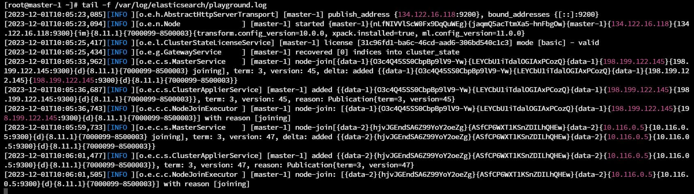

##### Validate Elasticsearch on the master node:

##### All available "_cat" API endpoints:

##### Nodes Endpoint:
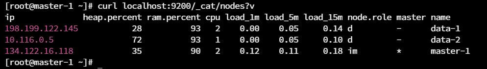

##### Nodes Endpoint Through Kibana Console:

(<a href="#readme-top">back to top</a>)

### 2. Security

##### a. Create Our Own PKI (Public Key Infrastructure)

The first thing that we have to do before encrypting the networks of our clusters,
when need to create some certificates. We need to create our own PKI (Public Key
Infrastructure). Note that to have a series of certificates, one for each node,
all the certificates have to trust each other; so they all have to be signed by
the certificate authority.
So, what we will do is:
* Generate a certificate authority (CA). Also, protect the CA with a passphrase. That
way, anyone wants to sign node certificate with that CA will need to provide that
passphrase:

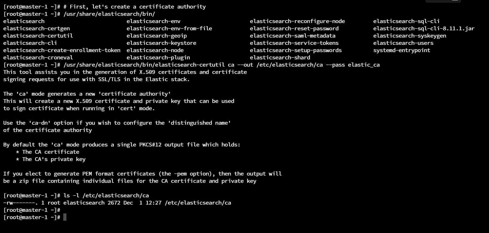

* Use the CA to sign node certificates for each node in our cluster, and we're going
to pass in the identifiable information (DNS and IP) of each node so that 
we can support full verification. That way, the certificate of master-1 node 
can't be used by anyone that want to join in our cluster; because it's only 
going to work on the master-1 node. Furthermore, we will protect the node certificate
with a passphrase. That way, not only does this certificate have to be used on a host
with this DNS and IP address, but in order to use it as an application, you have
to know the passphrase for this certificate. So this is by far, the most secure
way to use PKI. Now, we are sure that not only we're going to encrypt the 
communications using the certificate, but the actual use of the certificate is 
as protected as it can be.

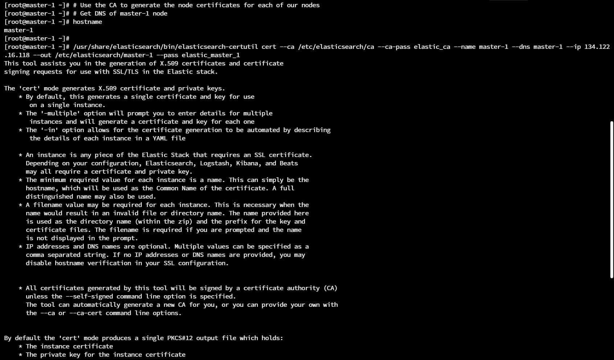

* Generate certificates the same way as well for data-1 and data-2:

* Now, we will use this PKI (Public Key Infrastructure) that we just built to 
encrypt the transport network, which is the node-to-node communication network of
Elasticsearch, and encrypt as well the client network which is the network that
we interact with using the rest APIs.

##### b. Encrypt The Transport Network

* The Transport Network is the node-to-node communication of the cluster. So, we
as clients, don't have any direct interaction, with this network. However, this
traffic could be intercepted and interpreted to essentially leak data about the cluster.

* Encrypt Transport Network Configurations on The Master Node:

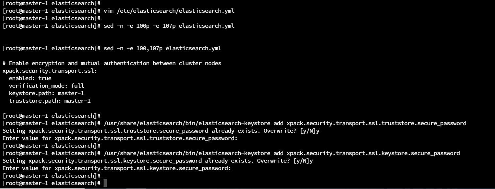

* We do the exact same for data-1 and data-2 as well.

* After encrypting the transport network and enabling the security pack, we
no longer can query the API without authentication as we did before:

* So, we need to set built-in user passwords to connect to our
cluster.

##### c. Set Built-in User Passwords

* I used the elasticsearch-reset-password utility to reset the password for all
available users.

* Then set the elasticsearch user in kibana.yml configurations file to allow
Kibana to communicate with Elasticsearch with user "kibana".
* Now, Kibana can communicate with Elasticsearch using the user "kibana".
* We also can log into Kibana using user "elastic"

##### d. Encrypt The Client Network

* To enable the client Network Encryption and make the cluster listen on HTTPS
instead of HTTP, we will use the same certificates that we used to encrypt the 
transport network.

* We edit the HTTP SSL security configurations in elasticsearch.yml on the master node:

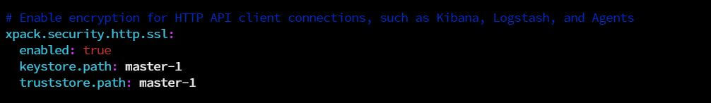

* We do the same on the other data nodes as well.

* We also need to edit Kibana configurations to make it communicate
with Elasticsearch over HTTPs:

* Now, our requests are fully encrypted, but since we used self-signed certificates,
they won't be trusted by any client by default.

##### e. Define Roles

* Now that we have user access control enabled and protecting our cluster and 
kibana instance, we can now create our own custom roles and users.

* Create a read-only role called "read_only" which has a privilege to read all
indices.

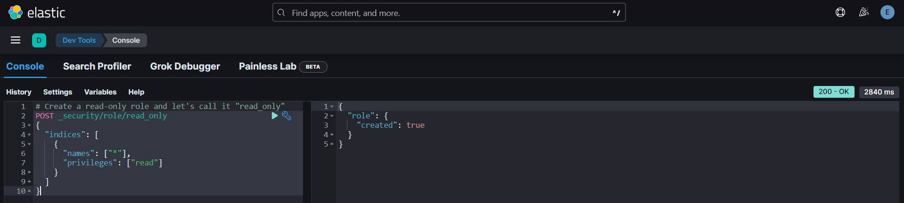

* Query the read_only role info:

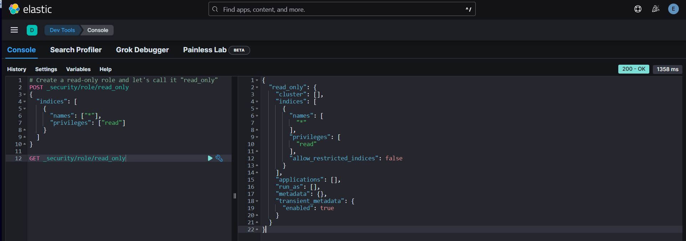

##### f. Create Users

* Create a user with the custom role that we've created "read_only"
and a built-in role "kibana_user"; to allow the user to log into
Kibana

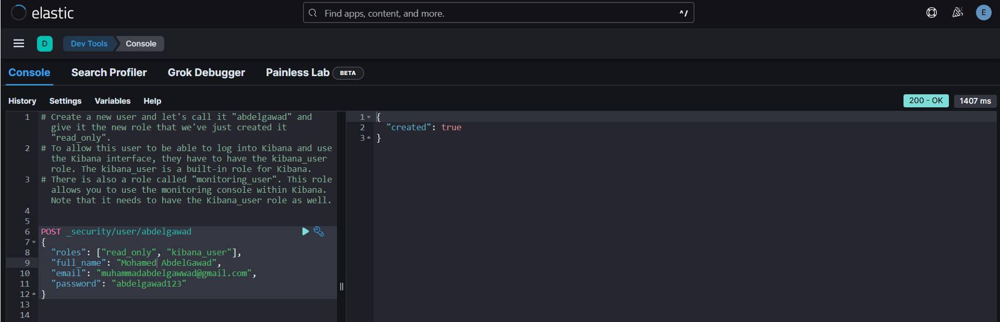

* Query the user that we've just created it

(<a href="#readme-top">back to top</a>)

### 3. Index

#### a. Define Indices

* Create an index called "bank" and configure it to have one shard and one 
replica:

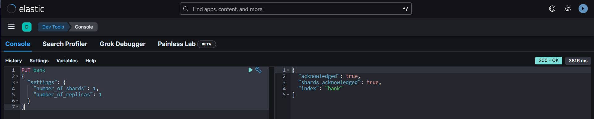

* Create an index called "shakespeare", override the dynamic mapping of multiple
fields, and configure it to have one shard and one replica:

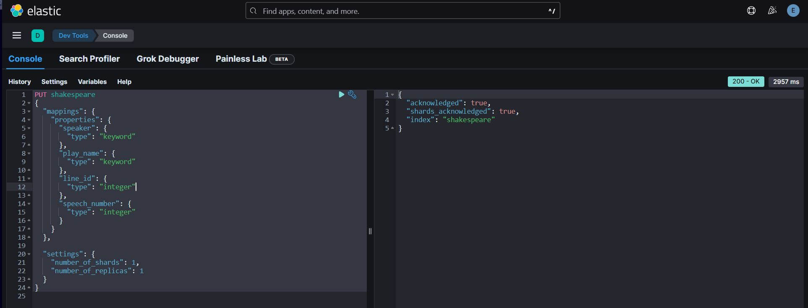

* Create an index called "logs" where we define a field of type geo point, which is
the longitude and latitude location of an IP address.

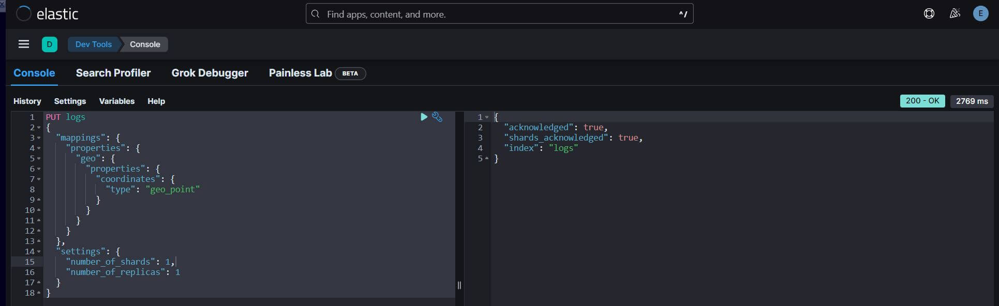

* Check all the indices we have so far in our cluster

#### b. Bulk Index Data

* Bulk indexing the bank index with a file of type New-Line Delimited JSON file:

* Do the same for the shakespeare index:

* Do the same as well for the logs index:

* Check indices in the cluster

#### c. Perform CRUD Operations

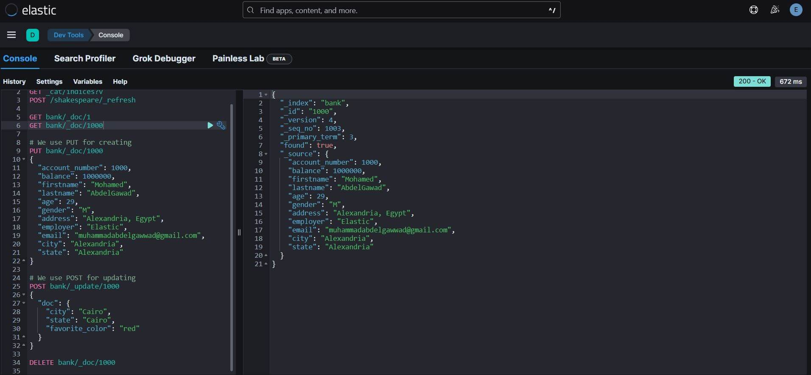

(<a href="#readme-top">back to top</a>)

### 4. Query

#### a. Execute Non-Analyzed Search Queries

#### b. Execute Analyzed Search Queries

#### c. Define Metric Aggregations

#### d. Define Bucket Aggregations

#### e. Define Sub-Aggregations

#### f. Define Pipeline Aggregations

(<a href="#readme-top">back to top</a>)

### 5. Administration

#### a. CAT APIs

#### b. Monitor Your Cluster

#### c. Diagnose and Repair Shard Issues

(<a href="#readme-top">back to top</a>)

<!-- CONTACT -->
## Contact

Mohamed AbdelGawad Ibrahim - [@m-abdelgawad](https://www.linkedin.com/in/m-abdelgawad/) - <a href="tel:+201069052620">+201069052620</a>

(<a href="#readme-top">back to top</a>)

<!-- References -->
## References

* Elasticsearch Deep Dive Course: https://www.pluralsight.com/cloud-guru/courses/elasticsearch-deep-dive
* “Hot-Warm” architecture: https://www.elastic.co/fr/blog/hot-warm-architecture
* Elasticsearch Node Configuration: https://www.elastic.co/guide/en/elasticsearch/reference/current/modules-node.html

(<a href="#readme-top">back to top</a>)

<!-- MARKDOWN LINKS & IMAGES -->
<!-- https://www.markdownguide.org/basic-syntax/#reference-style-links -->
[linkedin-shield]: https://img.shields.io/badge/-LinkedIn-black.svg?style=for-the-badge&logo=linkedin&colorB=555
[linkedin-url]: https://www.linkedin.com/in/m-abdelgawad/
